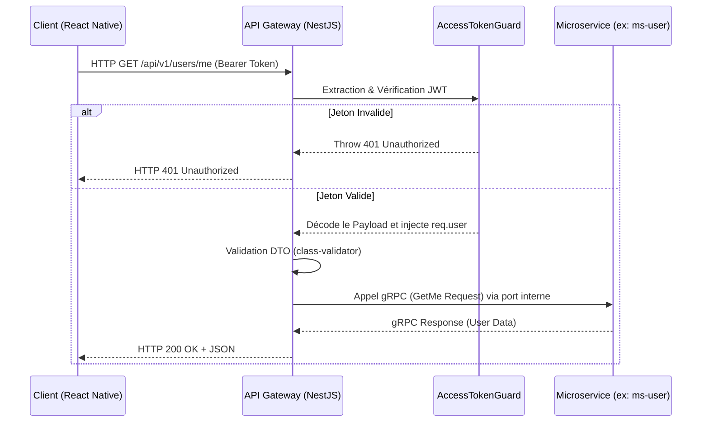

# Architecture - API Gateway

## Architecture Overview

L'API Gateway adopte le pattern **API Gateway / Backend For Frontend (BFF)**. Il ne contient aucune logique métier (Business Logic) lourde. Son rôle est strictement limité à l'exposition HTTP, la sécurisation, la validation des entrées et le proxying des requêtes.
Il repose sur une architecture modulaire classique de **NestJS** :

- **Controllers** : Gèrent les requêtes HTTP, définissent les routes (endpoints) et appliquent les Guards/Interceptors.
- **Modules** : Encapsulent les domaines fonctionnels (Event, Post, Social, User, Helper) pour maintenir un couplage faible et une isolation claire.
- **Services (Clients gRPC)** : Agissent comme des stubs pour invoquer des procédures distantes de manière transparente sur les microservices de backend.

## Directory Structure

```text
api-gateway/src/
├── common/             # Interceptors, filtres d'exceptions globaux et utilitaires partagés
├── config/             # Typage (CustomConfig) et validation de la configuration applicative
├── grpc/               # Configuration et instanciation dynamique des clients gRPC
├── modules/            # Modules de domaine (Features)
│   ├── event/          # Orchestration des requêtes liées aux événements
│   ├── health/         # Sondes de vitalité (Liveness/Readiness probes)
│   ├── helper/         # Utilitaires de développement (désactivé en environnement de production)
│   ├── post/           # Orchestration des requêtes liées au flux d'actualité
│   ├── social/         # Orchestration des requêtes liées aux relations sociales
│   ├── user/           # Orchestration des requêtes d'identité et de profils
│   └── ws-proxy/       # Proxying HTTP vers WebSockets (via ws-service) pour le feedback asynchrone
├── app.module.ts       # Module racine (Root Module) agrégeant l'ensemble des dépendances
└── main.ts             # Point d'entrée de l'application, instanciation des Pipes/Guards globaux
```

## Data Flow & Component Communication

Le flux nominal d'une requête HTTP traversant l'API Gateway pour atteindre un microservice est illustré ci-dessous :



## Design Decisions & Trade-offs

### 1. Protocole Inter-Services : gRPC vs HTTP/REST

**Décision** : Utilisation de **gRPC** (via `@grpc/grpc-js` et `@nestjs/microservices`) pour la communication synchrone entre l'API Gateway et les microservices sous-jacents, tandis que l'exposition vers l'extérieur reste en HTTP/REST.
**Compromis (Trade-offs)** :

- _Avantages_ : Sérialisation binaire (Protocol Buffers) ultra-performante minimisant la bande passante, typage fort des contrats de communication évitant les erreurs de formatage, et très faible latence réseau au sein du cluster Kubernetes.
- _Inconvénients_ : Complexité accrue lors de l'implémentation et du débogage manuel des flux (nécessite des outils adaptés comme `grpc-ui` pour inspecter le trafic binaire).

### 2. Validation Globale et Filtrage Strict

**Décision** : Activation de `ValidationPipe` en mode `transform: true` au niveau global (`main.ts`).
**Compromis (Trade-offs)** :

- _Avantages_ : Sécurité par défaut élevée (rejet immédiat des payloads malformés ou des tentatives d'injection), certitude mathématique que les couches inférieures reçoivent des objets instanciés et valides conformes aux DTOs.
- _Inconvénients_ : Un très léger surcoût CPU (overhead) est induit par l'utilisation intensive de la réflexion (reflect-metadata) et l'instanciation des classes à la volée pour chaque requête entrante.

### 3. Délégation WebSockets

**Décision** : Externalisation de la complexité de gestion des connexions persistantes (WebSockets) via un `WsProxyModule` qui agit en relais vers un `ws-service` dédié.
**Compromis (Trade-offs)** :

- _Avantages_ : Protège l'API Gateway des problématiques de state management inhérentes aux WebSockets (Memory Leaks, max connections), conservant la passerelle stateless et facilement scalable horizontalement.
- _Inconvénients_ : Introduit un saut réseau supplémentaire (hop) pour l'initialisation de la connexion WebSocket.
